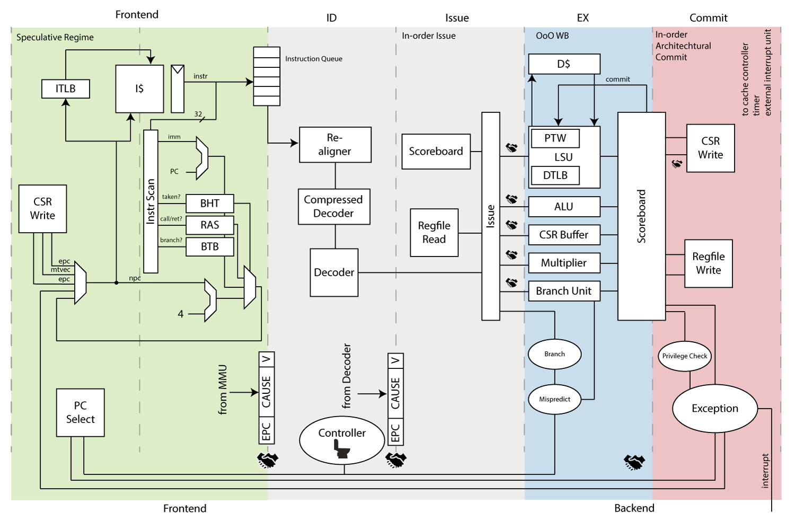

[](https://travis-ci.org/pulp-platform/ariane)

# Ariane RISC-V CPU

Ariane is a 6-stage, single issue, in-order CPU which implements the 64-bit RISC-V instruction set. It fully implements I, M and C extensions as specified in Volume I: User-Level ISA V 2.1 as well as the draft privilege extension 1.10. It implements three privilege levels M, S, U to fully support a Unix-like operating system.

It has configurable size, separate TLBs, a hardware PTW and branch-prediction (branch target buffer and branch history table). The primary design goal was on reducing critical path length.



## Getting Started


Go and get the [RISC-V tools](https://github.com/riscv/riscv-tools).

Checkout the repository and initialize all submodules
```
git clone https://github.com/pulp-platform/ariane.git
git submodule update --init --recursive
```

The Verilator testbench relies on our forked version of `riscv-fesvr` which can be found [here](https://github.com/pulp-platform/riscv-fesvr). Follow the README there and make sure that your compiler and linker is aware of the library (e.g.: add it to your path if it is in a non-default directory).

Build the Verilator model of Ariane by using the Makefile:
```
make verilate
```

This will create a C++ model of the core including a SystemVerilog wrapper and link it against a C++ testbench (in the `tb` subfolder). The binary can be found in the `obj_dir` and accepts a RISC-V ELF binary as an argument, e.g.:

```
obj_dir/Variane_wrapped -p rv64um-v-divuw
```

The Verilator testbench makes use of the `riscv-fesvr`. That means that bare `riscv-tests` can be run on the simulator.

> Due to the way the C++ testbench is constructed we need a slightly altered version of the `riscv-fesvr` which can be found [here](https://github.com/pulp-platform/riscv-fesvr).

### Running custom C-code

It is possible to cross compile and run your own C-code or benchmarks on Ariane. The following steps need to be followed to compile and run:

Compile the file using the following command (you need to have the [riscv-tests](https://github.com/riscv/riscv-tests) repo checked-out):

```
riscv64-unknown-elf-gcc -I./riscv-tests/benchmarks/../env -I./riscv-tests/benchmarks/common \
-DPREALLOCATE=1 -mcmodel=medany -static -std=gnu99 -O2 -ffast-math -fno-common \
-fno-builtin-printf ./riscv-tests/benchmarks/common/syscalls.c -static -nostdlib \
./riscv-tests/benchmarks/common/crt.S  -nostartfiles -lm -lgcc \
-T ./riscv-tests/benchmarks/common/test.ld -o hello.riscv hello.c
```

Use the generated ELF file as an input to the Verilator model:

```
obj_dir/Variane_wrapped -p hello.riscv
```

## Planned Improvements

While developing Ariane it has become evident that, in order to support Linux, the atomic extension is going to be mandatory. While the core is currently booting Linux by emulating Atomics in BBL (in a single core environment this is trivially met by disabling interrupts) this is not the behavior which is intended. For that reason we are going to fully support all atomic extensions in the very near future.

## Going Beyond

The core has been developed with a full licensed version of QuestaSim. If you happen to have this simulator available yourself here is how you could run the core with it. You need to generate **both** an `elf` file and a `hex` file, most easily this can be done by calling:

```
elf2hex 8 2097152 elf_file.riscv 2147483648  > elf_file.riscv.hex
```

Start the simulation using Modelsim:
```
make build
make sim
```
To specify the test to run use (e.g.: you want to run `rv64ui-p-sraw` inside the `tmp/risc-tests/build/isa` folder:
```
make sim riscv-test=rv64ui-p-sraw
```
If you need to specify a different directory you can pass the optional `riscv-test-dir` flag:
```
make sim riscv-test=elf_name riscv-test-dir=/path/to/elf/and/hex/file
```
If you call `simc` instead of `sim` it will run without the GUI.

### Unit Tests

Or start any of the unit tests by:
```
make alu
```

### Randomized Constrained Testing with Torture

Ariane's core testbench is fully compatible with the randomized constrained testing framework called Torture. To start testing Ariane all you need is to step into the `riscv-torture/` folder and issue:
```
make rgentest
```
Which will produce a single randomized program, runs it on Spike (see [Getting Started](#getting_started)) and on the RTL simulator (QuestaSim) by calling `ariane-run-torture`.

Torture's overnight tests work the same way, just call
```
make rnight
```
C (a.k.a. Verilator) tests are currently not supported.

# Contributing

Check out the [contribution guide](CONTRIBUTING.md)

