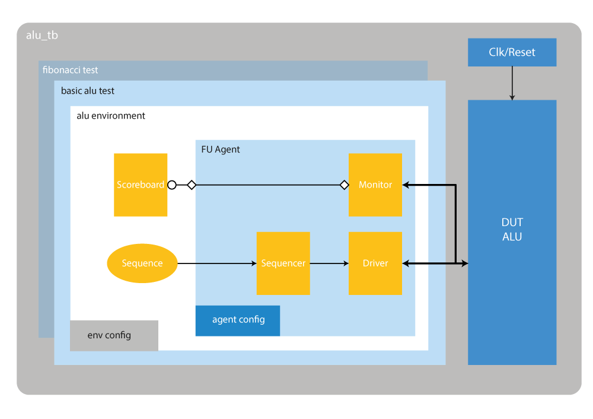

# Testbench

The test-bench should evolve according to the following steps:

1.  Basic Usage: Behavioral memories and boot-code. With the option of a EOC flag.
2.  Constrained Random Testing: By co-simulating on a golden model (e.g.: Spike ISA simulator) and comparing signatures. Tests generated by the torture test framework.
3.  System Integration: Complete system integration.

Current functional coverage report is located at [here](http://www.be4web.net/ariane/covhtmlreport).

## Functional Unit Testbench

The testbench for Ariane's functional unit is a classical UVM testbench. It contains an agent that drives the generic FU interface described in an earlier section. The block diagram is depicted in the following image:


A single sequence item consists of the following entries:

```
    logic[7:0]       operator;
    rand logic[64:0] operand_a;
    rand logic[64:0] operand_b;
    rand logic[64:0] operand_c;

    logic[64:0]      result;
    logic            compare_result;
```

Currently the testbench is limited to the ALU use-case, e.g.: a single instruction needs exactly one cycle and it implements logical operations, arithmetic operations and shifts logical/arithmetic left and right.

## Scoreboard Testbench

This is a basic testbench using a program block and two clocking ports. One for driving the DUT and one for monitoring output. There is a very rudimentary golden model that checks for the monitors answers.