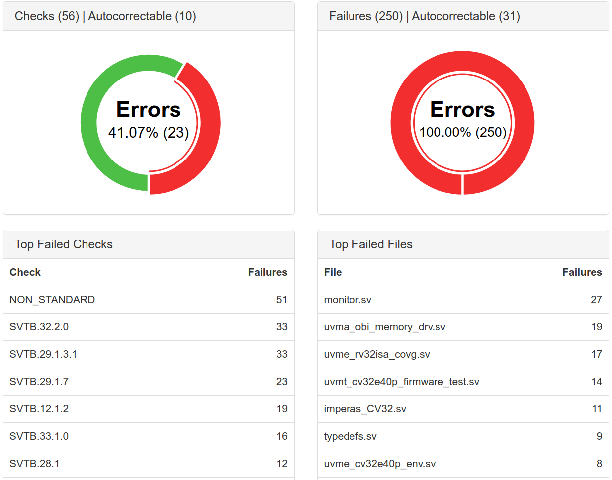

# Verissimo SystemVerilog Testbench Linter

Verissimo SystemVerilog Testbench Linter is a coding guideline and verification methodology compliance checker that enables engineers to perform a thorough audit of their testbenches.

With this tool, users can check for language pitfalls, semantic and style issues, and compliance with the appropriate methodologies. Verissimo can be customized to check specific group or corporate coding guidelines to ensure consistency and best practices in code developing.

Verissimo performs a thorough static analysis of the source code. It checks the following areas:
+ Suspicious language usage such as non-standard syntax, problematic delta cycle usage, and prohibited system calls.
+ Semantic issues that are not caught by the SystemVerilog compiler, for example, an overridden non-virtual method, which will likely result in unexpected behavior.
+ Improper styling such as confusing declaration order and naming conventions.
+ Verification methodology violations such as inappropriate object creation, missing calls, and constructs that should be avoided.
+ Unused code elements such as variables that are never read or written, or functions that are never called.
+ Performance issues like not passing arrays by reference to avoid useless copies.
+ Copy & paste code duplication.

The continous integration with the ***core-v-verif*** project is available [here](https://www.dvteclipse.com/core5verif-verissimo/1/main/index.html), where several release and dev branches are analyzed, including pull requests.

This folder also contains a ruleset file called ***ruleset.xml***, used to define the set of rules to be applied in a linting session and a waivers file called ***waivers.xml*** used to hide, demote or promote linting failures.

More information cand be found on the [Verissimo User Guide Page](https://www.dvteclipse.com/documentation/svlinter/index.html).
